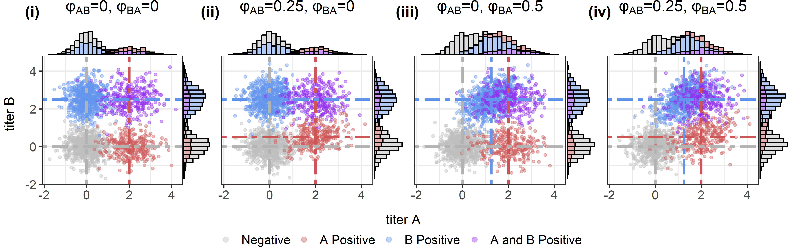

MultiSero
================

This method uses multi-pathogen serological data to simultaneously
estimate the prevalence of antibodies against each pathogen and
between-pathogen cross-reactive relationships. Sources of multi-pathogen
serological data can come from multiplex binding immunoassays and/or
separate immunoassays (e.g. ELISAs) that have been run on the same
samples. To account for cross-reactivity among related pathogens,
antibodies should be measured against the same antigen across pathogens
(e.g. envelope protein for flaviviruses).

## Concept: antibodies as multivariate Gaussian components

We use a simulated example to demonstrate the model concept, where
antibody titers against two pathogens, A and B, have been measured in a
study population. With only two pathogens, we can characterize this data
using two-dimensional Gaussian components. Assuming both pathogens have
transmitted in this population there are four possible infection
statuses (or antibody profiles) that we will characterize using Gaussian
components:

- Negative (grey)
- A positive (red)
- B positive (blue)
- A and B positive (purple)

The scatter plots below show how the characteristics of these four
Gaussian components change in scenarios of varying levels of
cross-reactivity, with log antibody titer measurements against pathogens
A and B shown on the x and y-axes. Here, $\phi$ is the cross-reactivity
parameter defined as the relative titer increase (e.g. binding) induced
by the infecting pathogen against the other pathogen(s). A value of
$\phi=0$ indicates no recognition/binding of the antibodies to the other
pathogen and $\phi=1$ indicates identical recognition/binding of the
antibodies to both pathogen. All other parameters are assumed constant
across scenarios (i)-(iv). The histograms on the top and right axes show
the single-dimension antibody titer distributions for pathogen A and
pathogen B respectively. Dashed lines show the means of the Gaussian
components. We describe each of the scenarios (i-iv) below.

<!-- -->

**Scenario (i): No cross-reactivity**

In this baseline scenario we assume pathogens A and B to be unrelated
(i.e. no cross-reactivity). The mean titer of the A-positive component
(red) against pathogen B is equal to that of the negative component
(grey horizontal line), while the mean titer of the B-positive component
(blue) against pathogen A is also equal to that of the negative
component (grey vertical line).

**Scenario (ii): Cross-reactivity from A to B**

In this scenario we assume that antibodies induced by infection with
pathogen A partially recognize pathogen B ($\phi_{AB}=0.25$), but
antibodies induced from infection by pathogen B do not recognize
pathogen A ($\phi_{BA}=0$). Here, the Gaussian component that is
A-positive (red) has shifted upwards on the y-axis, shown by the
horizontal red line, due to the these antibodies now partially
recognizing/binding pathogen B. The mean titer of these antibodies
against pathogen B is now 0.5 (calculated as shown below), higher than
the mean of the negative component (grey). Here, $\mu_{0,B}$ is the mean
of the negative titers against pathogen B and $\mu_{1,A}$ is the mean
titer increase against pathogen A induced by infection with pathogen A.
The increase in common binding also proportionally increases the
correlation and covariance of the A-positive (red) component.

$$\mu_{0,B} + \phi_{AB} * \mu_{1,A}$$ $$= 0 + 0.25*2$$ $$= 0.5$$

**Scenario (iii): Cross-reactivity from B to A**

We now assume that antibodies induced by infection with pathogen B
recognize pathogen A ($\phi_{BA}=0.5$), while antibodies induced from
infection by pathogen A do not recognize pathogen B ($\phi_{AB}=0$).
Here, the Gaussian component that is B-positive (blue) has shifted right
on the x-axis, shown by the vertical blue line, due to these antibodies
partially recognizing/binding pathogen A. The mean antibody titer of
this component against pathogen A is now 1.25 (calculated as shown
below), higher than the mean of the negative component (grey). Here,
$\mu_{0,A}$ is the mean of the negative titers against pathogen A and
$\mu_{1,B}$ is the mean titer increase against pathogen B induced by
infection with pathogen B. The increase in common binding also
proportionally increases the correlation and covariance of the
B-positive (blue) component.

$$\mu_{0,A} + \phi_{BA} * \mu_{1,B}$$ $$= 0 + 0.5*2.5$$ $$= 1.25$$

**Scenario (iv): Cross-reactivity in both directions**

In this last scenario we assume cross-reactivity in both directions,
where antibodies induced from infection by each pathogen recognize the
other pathogen to varying extents. The A-positive (red) Gaussian
component now shifts up on the y-axis (due to binding against pathogen
B) and the B-positive (blue) Gaussian component shifts right on the
x-axis due to binding against pathogen A. The means of these components
are calculated in the same way as scenarios (ii) and (iii).

## Example application of the model

We will walk through an example of applying the model. In this dataset
we have antibody measurements against 10 arbovirus antigens from a
multiplex assay.

``` r
# read in data
df <- read.csv(here('data', "arbovirus_serology.csv"))

# define pathogens
pathogens <- colnames(df)[3:12]
print(pathogens)
```

    ##  [1] "DENV1" "DENV2" "DENV3" "DENV4" "JEV"   "WNV"   "TBEV"  "ZIKV"  "YFV"  
    ## [10] "CHIKV"

``` r
# source functions 
source(here('R', 'RFunctions.R'))
```

We then need to specify which pathogens we assume to be present
(i.e. those that have transmitted in the study population), versus those
we assume to be absent. The model will see if antibody responses against
the absent pathogens can be explained by cross-reactivity from the
present ones. In this example, we assume DENV1, CHIKV and JEV to be
present and all other pathogens to be absent. In datasets where the
status of pathogen presence/absence is not know, we suggest to conduct a
variable (pathogen) selection process (details in O’Driscoll et al.,) to
assess the evidence of pathogen presence.

``` r
present <- c("DENV1","CHIKV","JEV")
nonpres <- pathogens[!pathogens %in% present]
pathogens <- c(present, nonpres) # reorder pathogen list with present pathogens first 
```

### Model inputs

We will next compile a list of model inputs. In this example, we are
allowing pathogen prevalence to vary by age group and location.

``` r
# create list for inputs
data <- list()

# antibody measurement data (on log scale)
data$y <- cbind(log(df[,c(present,nonpres)])) 

# index for present/absent pathogens
data$pres <- c(rep(1,length(present)), rep(0, length(nonpres))) 

# N individuals in study population
data$N <- nrow(data$y) 

# N pathogens
data$nP <- ncol(data$y) 

# N present pathogens
data$nPp <- sum(data$pres) 

# Age group index
data$ageG <- df$ageG 

# Location index
data$loc <- df$locID 

# N age groups
data$nA <- 7 

# N locations
data$nL <- 5 

# N individuals per location 
data$NperL <- as.vector(table(df$locID)) 

# N individuals per location & age
data$NperLA <- t(table(df$locID, df$ageG)) 

# Proportion of study population by age group per location
data$ageProp <- as.matrix(table(df$locID, df$ageG) / data$NperL) 
```

We will also create some additional indices to help model computations.
The function inf_matrix creates a matrix of all possible infection
status combinations, given the assumed number of present pathogens. With
3 present pathogens, there are 8 possible infection status combinations
($2^3$) as shown in the matrix below. Here, values of 0/1 indicate being
negative/positive and columns a-j represent each pathogen.

``` r
# Matrix of infection status combinations
data$infM <- inf_matrix(data$nP, pres=data$pres) 
print(data$infM)
```

    ##   a b c d e f g h i j
    ## 1 0 0 0 0 0 0 0 0 0 0
    ## 2 1 0 0 0 0 0 0 0 0 0
    ## 3 0 1 0 0 0 0 0 0 0 0
    ## 4 1 1 0 0 0 0 0 0 0 0
    ## 5 0 0 1 0 0 0 0 0 0 0
    ## 6 1 0 1 0 0 0 0 0 0 0
    ## 7 0 1 1 0 0 0 0 0 0 0
    ## 8 1 1 1 0 0 0 0 0 0 0

``` r
# N possible infection statuses
data$nC <- nrow(data$infM) # N status combinations

# N positive pathogens per infection status
npos <- rowSums(data$infM)

# Compute indices for which matrix cells are negative (wneg) or positive (wpos) 
wpos <- matrix(0, ncol=data$nP, nrow=data$nC)
wneg <- matrix(0, ncol=data$nP, nrow=data$nC)
for(c in 1:nrow(data$infM)) for(p in 1:data$nP){
  if(npos[c]>0) wpos[c,1:npos[c]] <- which(data$infM[c,]==1)
  if(npos[c]<data$nP) wneg[c,1:(data$nP-npos[c])] <- which(data$infM[c,]==0)
  
}
data$npos <- npos 
data$wpos <- wpos 
data$wneg <- wneg 
```

### Fit model

The model is written in Stan and executed using CmdStan. For help
setting up CmdStanR, visit this page
(<https://mc-stan.org/cmdstanr/articles/cmdstanr.html>) The model can be
applied to any number of pathogens, though computational time increases
significantly as we consider more pathogens. This is because as the
number of pathogens is increased, the dimensions of the Gaussian
components and the number of possible infection statuses increase.

**Note:**

- As the scale of antibody measurements will vary across assays, it is
  important to adjust model priors for the mu0, mu1, sd0 and sd1
  parameters in the Stan file accordingly.

- Setting reasonable parameter starting values for each chain when
  running the model can help speed up model run times and improve
  convergence.

``` r
# check cmdstan toolchain & set cmdstan path
check_cmdstan_toolchain()
set_cmdstan_path('C:/Users/megan/.cmdstan/cmdstan-2.35.0')

# Compile the model
mod <- cmdstan_model(here('StanModels', 'MultiSero_LocAge.stan'), pedantic=F) 

# set output path
folder <- paste(present,collapse='+')
dir.create(here('Results', folder))

# run model
fit <- mod$sample(data=data, chains=3, parallel_chains=3, iter_sampling=3000,
                  refresh=100, iter_warmup=3000, output_dir=here('Results', folder))
```

Once finished running, check chain convergence and model diagnostic
metrics.

``` r
# extract chains
chains <- fit$draws(format='df')

# save chains
fwrite(chains, 'Chains.csv')

# look at some trace plots
color_scheme_set("mix-blue-red")
mcmc_trace(chains, regex_pars = c("seroAll","lp__"))
mcmc_trace(chains, regex_pars = c("mu0","mu1"))
mcmc_trace(chains, regex_pars = c('sd0','sd1'))
mcmc_trace(chains, regex_pars = c('phi','rho00'))
```

And finally, extract model estimates.

``` r
# format chains as dataframe
chains <- as.data.frame(chains)

# extract prevalence estimates
loc <- unique(df$upazila) # location names
sero <- extract_sero(chains, data, pathogens)
seroLoc <- extract_seroLoc(chains, data, pathogens, loc)
seroAge <- extract_seroAge(chains, data, pathogens, ageG=c('0-9','10-19','20-29','30-39','40-49','50-59','60+'))
seroLocAge <- extract_seroLocAge(chains, data, pathogens, loc, ageG=c('0-9','10-19','20-29','30-39','40-49','50-59','60+'))

# extract cross-reactivity estimates
phi <- extract_phi(chains, data, pathogens)

# extract Gaussian means & sds
mu <- extract_mu(chains, data, pathogens=pathogens)
sds <- extract_sds(chains, data)
```
